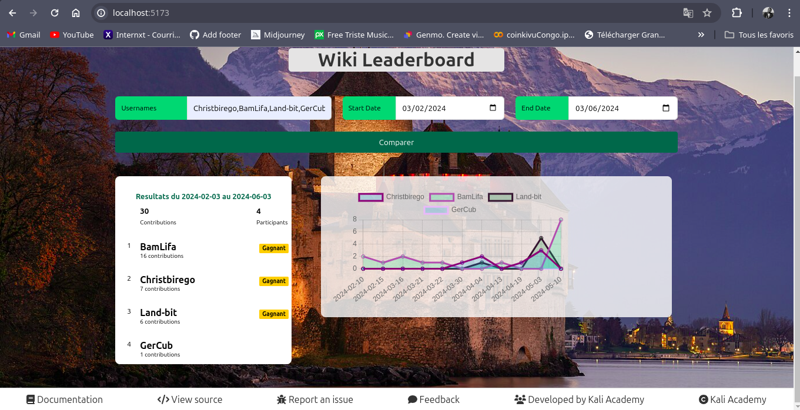

# LeaderBoard

LeaderBoard est une application servant de comparateur 


## Features

- **Add New Scores**: Easily add new scores to the leaderboard.
- **View Rankings**: Display the current rankings in an organized manner.
- **Update and Delete**: Modify or remove existing scores.

## Getting Started

### Prerequisites

- Node.js
- npm or yarn

### Installation

1. Clone the repository:
   ```sh
   git clone https://github.com/kaliacad/LeaderBoard.git
   ```
### Navigate to the project directory:

    ```sh
        Copier le code
        cd LeaderBoard 
    ```
### Install dependencies:

    ```sh 
        npm install
    ```
    or 

    ```sh 
        yarn install
    ```
### Running the Application:

    ```sh 
        npm run dev
    ```
    or 
    ```sh
        yarn dev 
    ```
Open http://localhost:3000 to view it in your browser.

### Folder Structure

.
├── public/          
│   └── index.html
├── src/             
│   ├── components/  
│   │   └── App.js
│   └── styles/      
│       └── App.css
├── .gitignore
├── package.json
└── README.md


### License
This project is licensed under the MIT License.

